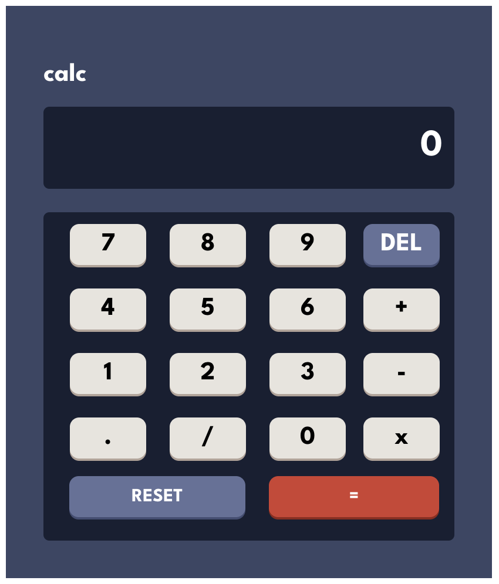

# Frontend Mentor - Calculator app solution

This is a solution to the [Calculator app challenge on Frontend Mentor](https://www.frontendmentor.io/challenges/calculator-app-9lteq5N29). Frontend Mentor challenges help you improve your coding skills by building realistic projects.

## Table of contents

- [Overview](#overview)
  - [The challenge](#the-challenge)
  - [Screenshot](#screenshot)
  - [Links](#links)
- [My process](#my-process)
  - [Built with](#built-with)
  - [Continued development](#continued-development)
- [Author](#author)

## Overview

### The challenge

Users should be able to:

- See the size of the elements adjust based on their device's screen size
- Perform mathmatical operations like addition, subtraction, multiplication, and division

### Screenshot

- Calculator: 

### Links

- Solution URL: [Add solution URL here](https://github.com/fgrullon/calculator-app)
- Live Site URL: [Add live site URL here](https://heartfelt-biscochitos-bfe262.netlify.app/)

## My process

### Built with

- Semantic HTML5 markup
- CSS custom properties
- Flexbox
- [React](https://reactjs.org/) - JS library
- [Vite](https://vitejs.dev/guide/) - React framework
- [Styled Components](https://styled-components.com/) - For styles

### Continued development

There some things i wanna improve later, the first one in the stlyng of the buttons when clicked, later on adding the colors theme.

## Author

- Linkeding - [@frank-grullon](https://www.linkedin.com/in/frank-grullon/)
- Twitter - [@fgrullon](https://www.twitter.com/fgrullon)
